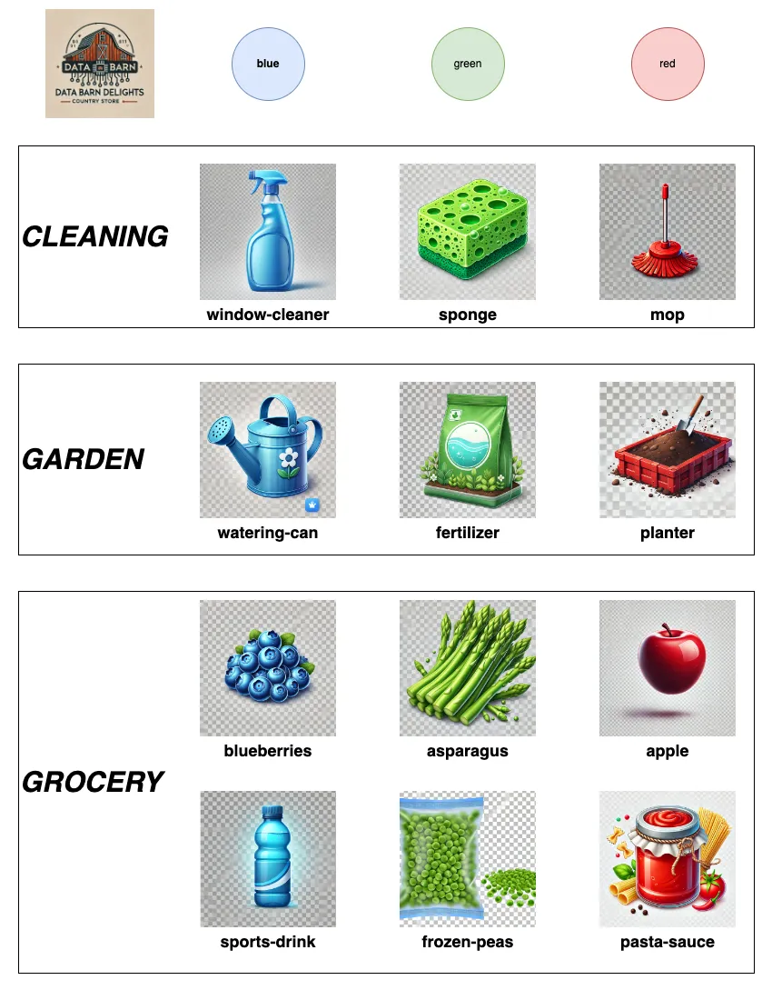
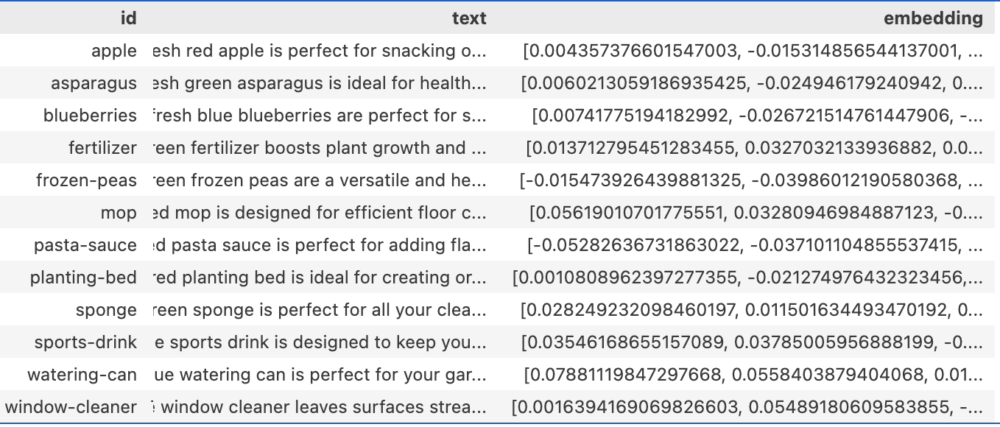
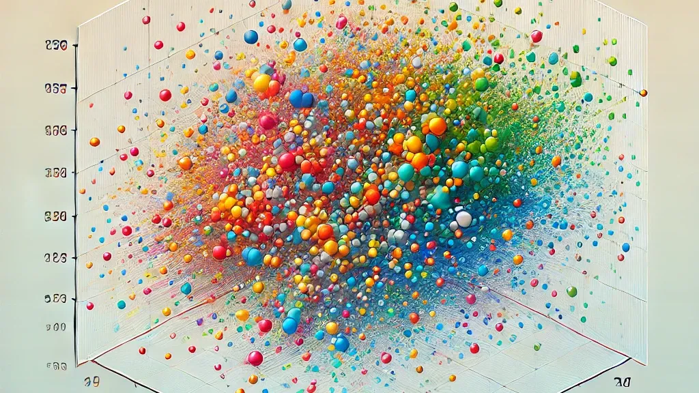
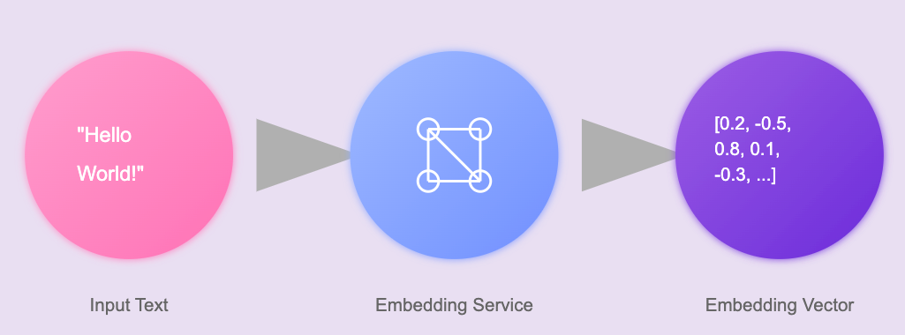
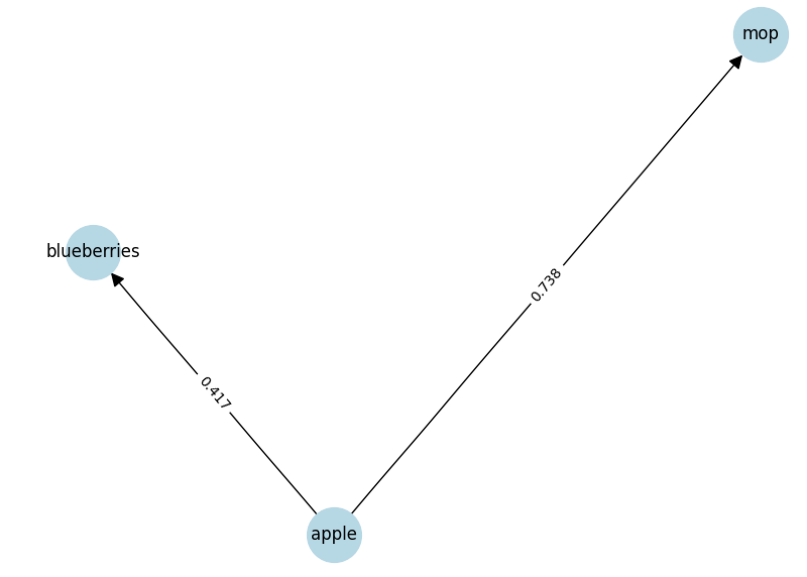
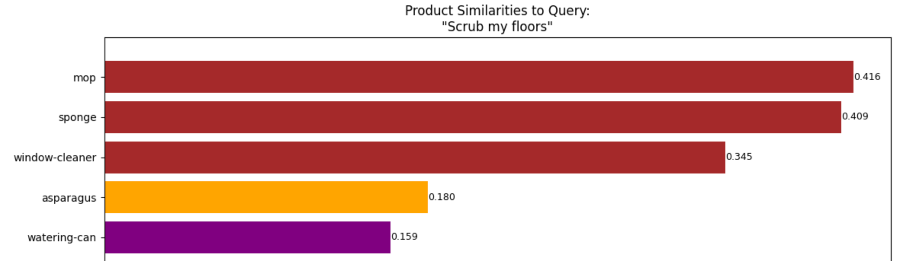
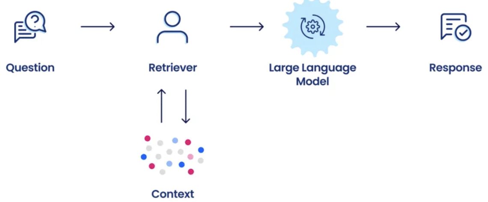
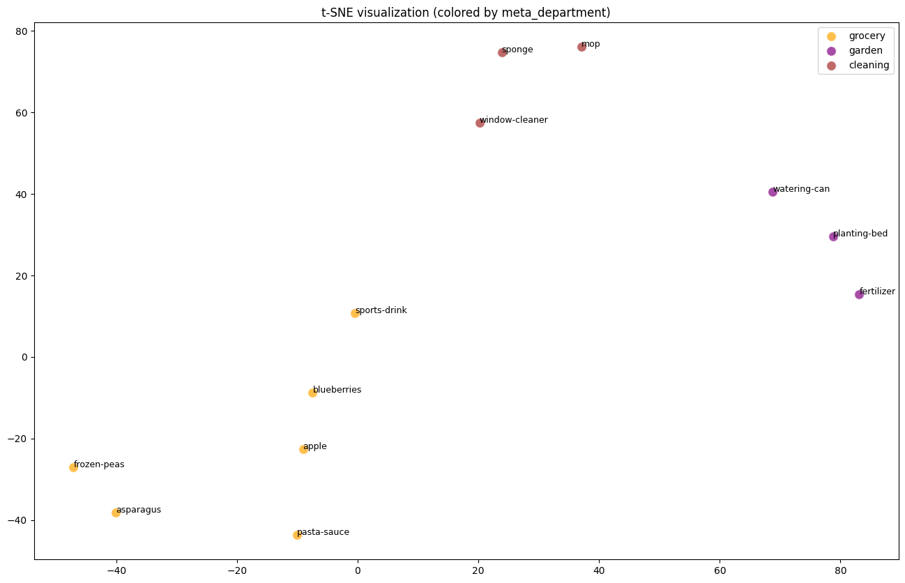

# Math, Magic, and Meaning
### Unlocking AI’s Hidden Superpower

(Presentation AND Notebook)
https://github.com/nagoodman/embedding-tutorials

<!-- Speaker Notes:
Welcome! This session is all about AI embeddings. We’ll unravel what they are, take a brief look at their origins, and explore their wide range of applications. Throughout, we’ll use examples from the "Barn Delights" store to keep things practical and relatable.
-->

---

## Agenda

- Data Barn Delights
- What Are AI Embeddings?
- Real-World Applications
  - Semantic Search
  - Recommendation Systems
  - Reponse-Augmented Generation
- Challenges
- Future

## Nicholas Goodman

LinkedIn: @nicholasandrewgoodman
X: @notachanceimstillthere

---

## Barn Delights: Products as Embeddings

---

## What Are AI Embeddings?

- **Definition:** 
  - Vector representations of data in high-dimensional space.
- **Concept:**
  - Data points like words, images, or products are transformed into coordinates in a mathematical space.

---
# What Are AI Embeddings? (cont.)

---

## What Are AI Embeddings? (cont.)

### Why Use Them?
- Enable machines to understand emotions, meaning, and relationships.
- "Apple" and "Blueberries" are closer in this space than "Apple" and "Mop."

<!-- Speaker Notes:
Think of embeddings as a map where "apple" and "orange" are neighbors, while "mop" is in a different neighborhood.
-->

---

## What Are Embeddings Used For?

<!-- 

  
Semantic Search 

  
 Recommenedation Systems 

  
Retrieval-Augmented Generation

-->

---

### 1. Semantic Search
- **Problem:** Queries don’t always match document keywords.
- **Embedding Solution:** Find relevance by meaning, not exact matches.
- **Barn Delights Example:**

<!-- Speaker Notes:
Semantic search uses embeddings to understand the meaning behind queries. For example, if you search "scrub my floors," embeddings ensure the system finds mops, sponges, and cleaners, even if "scrub" isn’t in the product descriptions.
-->

---

### 2. Recommendation Systems
- **Embedding Role:** Group similar items based on similarity.

---

### 3. Retrieval-Augmented Generation (RAG)
- **Concept:** Use embeddings to find relevant information for generative AI.
- **Barn Delights Example:**
  - Query: “How do I start a garden?”
  - RAG Response: "You'll need seeds, fertilizer, and tools like a trowel."
  

---

## How Do You Build Embeddings?

1. **Prepare the Data:**
   - Clean, structure, and categorize your data.
2. **Select a Model:**
   - Example: `text-embedding-3-small` for text data.
   - Example: `embed-english-v3.0` for text+images
3. **Generate and Use:**
   - Generate embeddings for search, recommendations, and analytics.
4. **Vector Database:**
    - Either in your own database or using a vector database like [Pinecone](https://www.pinecone.io/)

---

## Challenges with Embeddings

1. **Data Quality:** Poor data = poor embeddings.
2. **Chunking:** Granularity of embeddings is important.
2. **Generalization:** Terms specific to a domain don't differentiate enough
2. **Scalability:** Embeddings for massive datasets are big (3-5x)
3. **Bias:** Models can inherit biases from training data.

---

## Future of AI Embeddings

1. **Cross-Modal Embeddings:** Unify text, images, and audio.
2. **Real-Time Applications:** Faster, more dynamic embeddings.
3. **Enhanced Personalization:** Tailor recommendations with more precision.

---

# Questions?
### Thank You for Exploring Embeddings!

--- 
# tSNE (map hyper dimensions to reduced)

